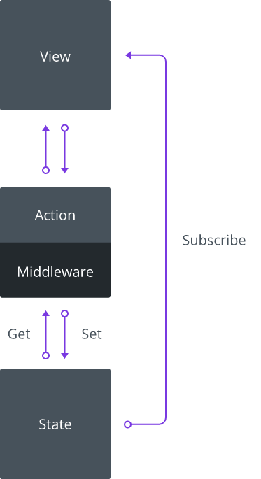

## Kubox

Kubox  administra el estado a base de acciones con contexto y manejo de asincronía fácilmente debuggable


## Action.

el action es el único que puede modificar el estado, mediante el primer argumento recibido, este argumento posee 2 métodos :

* **set** : permite editar, crear un nuevo estado y notificar a los suscriptores de dicho cambio.
* **get** : permite obtener el estado actual.

### Ejemplo de un action.

```js
export default function(state){
   let before = state.get(); // {}
              state.set({hello:"Kubox"});
   let after = state.get(); // {hello:"kubox"}
}
```
> el Action es libre de responder a la vista con lo que estime conveniente, pero única forma de modificar u obtener el estado es mediante  los métodos **set** y **get** del primer argumento entregado al Action.

## Store(object state, object actions)

La instancia del **store**, requiere 2 argumentos:

1. **state** : *{object}*, estado inicial para el store.
2. **actions** : *{object}*, acciones modificadoras del estado.

```js
import Store from "kubox";
import state from "./state";
import actions from "./actions";

export default new Store(state,actions);
```

La instancia del store define las siguientes propiedades:

* **state** : *{object}*, contiene el estado actual del store.
* **actions** : *{object}*, contiene las acciones asignadas al store.
* **subscribers** : *{object}*, contiene los  suscriptores a los cambios del estado dentro del store.
* **subscribe** : *{function}*, permite registrar un suscriptor al store, este a su vez retorna una función para eliminar el registro como suscriptor.

### Actions

Es un objeto que agrupa todas las acciones, este es escaneado sin importar su profundidad al momento de instanciar el store,para definir todos los actions dentro del store.


### Ejemplo actions

#### file actions.js

```js

function increment(state){
   state.set(
       (state.get()||0)+1
   );
}

function decrement(state){
   state.set(
       (state.get()||0)-1
   );
}

function replace(state,count){
   state.set(count);
}

export default {
   count : {
       increment,
       decrement,
       replace,
   }
}
```

#### file store.js

La instancia de store define los actions dentro de la propiedad de la instancia `store.actions`, mediante el tipeo camelCase generará los siguientes nombres de actions.

```js
import actions from "./actions";

let store =  new Store({},actions);

store.actions.countIncrement() // store.state {count:1}
store.actions.countDecrement() // store.state {count:0}
store.actions.countReplace(10) // store.state {count:10}
```

> Cualquier cambio que produce **count Increment**, **count Decrement** y **count Replace**, quedara contenido en la propiedad del estado **count**.

### action middleware

Si ud define un action en la raíz cuyo nombre de propiedad sea **middleware**, este action recibirá todas las ejecuciones de los demás **actions** recibiendo los siguientes argumentos adicionales al control de estado:

* **action** : *{string}*, nombre del action que lanza el cambio.
* **updater** : *{any}*, cambio lanzado por el action.

De esta forma el middleware controla cualquier cambio que apunta hacia el store desde un action, este tipo de acción es ideal para debug del store.

### Resumen de flujo de Kubox.



### subscribe(function handler[, string watch ])

Ud puede registrar en los cambios de todo el estado o apuntar a ciertos propiedades de el.

El subscriber será notificado siempre que se envíe desde **set**.


